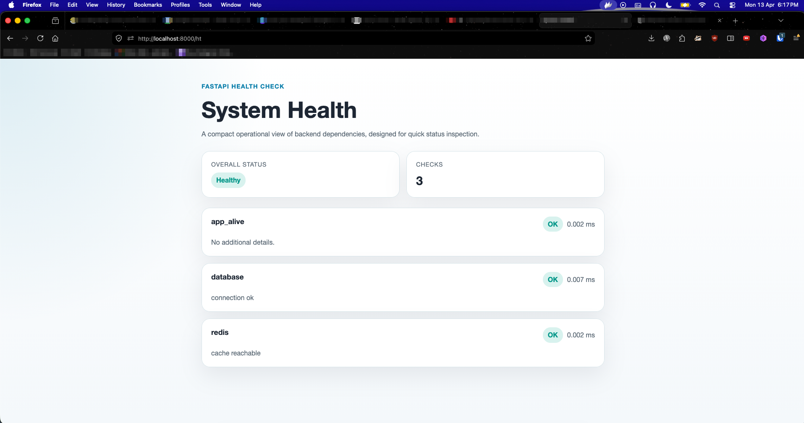

# fastapi-health-check

FastAPI health checks with a small public API, a visual status page, and JSON responses from the same endpoint.

## Visual overview


### Example interface



## What the library provides

- A base contract for advanced checks
- A lightweight registry for collecting and running checks
- A single `/ht` endpoint with HTML by default
- JSON responses when the client sends `Accept: application/json`
- A simple way to monitor any custom area of your system

## Important note

The library does not ship with a database check by default.

The only built-in check today is `AppAliveCheck`, which reports that the application is up. Database, Redis, queues, external APIs, or any other monitored area are meant to be registered by the user.

## Quick start

```python
from fastapi import FastAPI

from fastapi_health_check import AppAliveCheck, HealthRegistry, health_check, install_health_check


app = FastAPI()
registry = HealthRegistry(
    [
        AppAliveCheck(),
        health_check("database", lambda: "connection ok"),
        health_check("redis", lambda: "cache reachable"),
    ]
)

install_health_check(app, registry)
```

This exposes `GET /ht`.

- In a browser, the route renders an HTML health page
- For automated integrations, the same route returns JSON when the client sends `Accept: application/json`

## Monitoring custom areas

If you want to monitor anything beyond the built-in app liveness check, the easiest option is the `health_check()` factory.

You can use it for:

- databases
- Redis or cache layers
- background queues
- external APIs
- storage services
- internal domain-specific dependencies

### Synchronous checks

```python
from fastapi_health_check import health_check

database_check = health_check("database", lambda: "connection ok")
redis_check = health_check("redis", lambda: "cache reachable")
```

### Asynchronous checks

```python
from fastapi_health_check import health_check


async def payments_api_check() -> str | None:
    return "payments API available"


payments_check = health_check("payments_api", payments_api_check)
```

### Class-based checks for advanced cases

```python
from fastapi_health_check import HealthCheck


class QueueCheck(HealthCheck):
    default_name = "queue"

    async def check(self) -> str | None:
        return "queue connected"
```

Use class-based checks when you want:

- dependency injection through `__init__`
- reusable state
- more structured custom behavior

## Local manual testing

The repository includes a local example application at `src/examples/basic_app.py`.

Run it with:

```bash
uv run uvicorn src.examples.basic_app:app --reload
```

Then open:

- `http://127.0.0.1:8000/ht` for the HTML page
- `curl -H "Accept: application/json" http://127.0.0.1:8000/ht` for JSON
